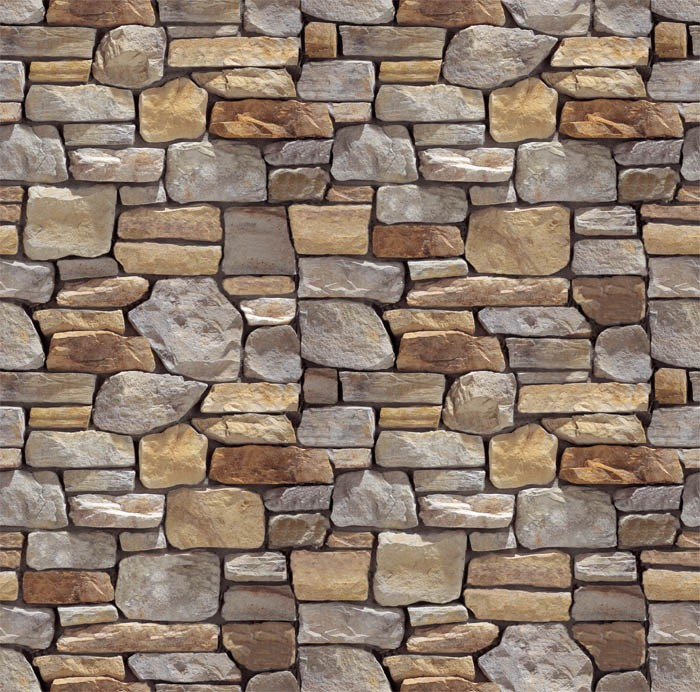
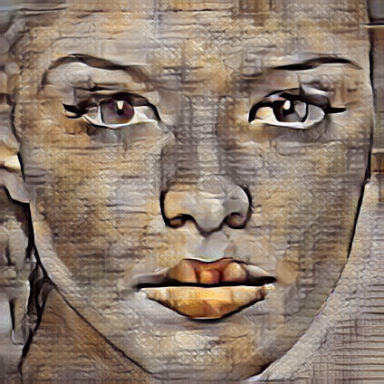

# Univeral Style Transfer

This repository is a PyTorch implementation of the paper [Universal Style Transfer via Feature Transforms](https://proceedings.neurips.cc/paper_files/paper/2017/file/49182f81e6a13cf5eaa496d51fea6406-Paper.pdf) [NIPS 2017].<br><br>

## Training

For the Universal Style Transfer framework to work, one needs to train up to 5 decoders for the pre-trained VGG-19 encoders, cut off at up to 5 different depths. For the training, one needs to download the [MS COCO](https://cocodataset.org/#home) training and validation datasets, and make sure that the model for the encoder at depth X has the following path: `models/encoders/encoderX.pth`.<br>

### Download data

In order to download the training and validation datasets, run the following commands:

```bash
cd data
sh download_data.sh
cd ..
```

### Run the training script

In order to start the training, run the following command:

```bash
python train.py --config /path/to/config/file.json --depth 1
```

* The `--config` argument specifies the path to the configuration file. The default configuration file is at `configs/default_config.json`. In order to use a custom configuration, create a `.json` file and pass its path to this argument.
* The `--depth` argument specifies the depth of the decoder to be trained. Depth has to be an integer from the set `{1, 2, 3, 4, 5}`.<br><br><br>

## Style Transfer

After the trainings are finished, make sure that the model for the decoder at depth `X` has the following path: `models/decoders/decoderX.pth`. You can run the style transfer framework in two modes, set by the `level` argument.

### Single-Level Style Transfer

Single-level style transfer uses only the encoder and the decoder at the specified depth `X`. The inference in single-level mode is done via the following command:

```bash
python stylize.py --level single --depth X --strength 1.0 --content_dir /path/to/content/directory --style_dir /path/to/style/directory --output_dir /path/to/output/directory
```

* The `--depth` argument specifies the depth of the single encoder-decoder model. Depth has to be an integer from the set `{1, 2, 3, 4, 5}`.
* The `--strength` argument specifies the strength of stylization. It has to be a floating-point number in the range `[0, 1]`. For single-level style transfer, it is recommended to have `--strength 1.0`, which is the default behavior of the framework.
* The `--content_dir`, `--style_dir`, and `--output_dir` arguments specify the directories of content images, style images, and the stylized content images (style transfer results), respectively.

### Multi-Level Style Transfer

Multi-level style transfer uses the encoder(s) and the decoder(s) from depth 1 up to the specified depth `X`. The inference in multi-level mode is done via the following command:

```bash
python stylize.py --level multi --depth X --strength 0.6 --content_dir /path/to/content/directory --style_dir /path/to/style/directory --output_dir /path/to/output/directory
```

* The `--depth` argument specifies the depth of the largest encoder-decoder model to be used. Depth has to be an integer from the set `{1, 2, 3, 4, 5}`.
* The `--strength` argument specifies the strength of stylization. It has to be a floating-point number in the range `[0, 1]`. For multi-level style transfer with depth `X`, it is recommended to have `--strength 0.2*X`, which is the default behavior of the framework.
* The `--content_dir`, `--style_dir`, and `--output_dir` arguments specify the directories of content images, style images, and the stylized content images (style transfer results), respectively.<br><br>

## Results

### Single-Level Style Transfer

<details>
<summary>Depth 1</summary>
<br>
<table class="center">
<tr>
  <td width=25% align="center"></td>
  <td width=25% align="center"></td>
  <td width=25% align="center"></td>
  <td width=25% align="center"></td>
</tr>
<tr>
  <td width=25% align="center"></td>
  <td width=25% align="center"></td>
  <td width=25% align="center"></td>
  <td width=25% align="center"></td>
</tr>
<tr>
  <td width=25% align="center"></td>
  <td width=25% align="center"></td>
  <td width=25% align="center"></td>
  <td width=25% align="center"></td>
</tr>
<tr>
  <td width=25% align="center"></td>
  <td width=25% align="center"></td>
  <td width=25% align="center"></td>
  <td width=25% align="center"></td>
</tr>  
</table>
</details>
<details>
<summary>Depth 2</summary>
<br>
<table class="center">
<tr>
  <td width=25% align="center"></td>
  <td width=25% align="center"></td>
  <td width=25% align="center"></td>
  <td width=25% align="center"></td>
</tr>
<tr>
  <td width=25% align="center"></td>
  <td width=25% align="center"></td>
  <td width=25% align="center"></td>
  <td width=25% align="center"></td>
</tr>
<tr>
  <td width=25% align="center"></td>
  <td width=25% align="center"></td>
  <td width=25% align="center"></td>
  <td width=25% align="center"></td>
</tr>
<tr>
  <td width=25% align="center"></td>
  <td width=25% align="center"></td>
  <td width=25% align="center"></td>
  <td width=25% align="center"></td>
</tr>  
</table>
</details>
<details>
<summary>Depth 3</summary>
<br>
<table class="center">
<tr>
  <td width=25% align="center"></td>
  <td width=25% align="center"></td>
  <td width=25% align="center"></td>
  <td width=25% align="center"></td>
</tr>
<tr>
  <td width=25% align="center"></td>
  <td width=25% align="center"></td>
  <td width=25% align="center"></td>
  <td width=25% align="center"></td>
</tr>
<tr>
  <td width=25% align="center"></td>
  <td width=25% align="center"></td>
  <td width=25% align="center"></td>
  <td width=25% align="center"></td>
</tr>
<tr>
  <td width=25% align="center"></td>
  <td width=25% align="center"></td>
  <td width=25% align="center"></td>
  <td width=25% align="center"></td>
</tr>  
</table>
</details>
<details>
<summary>Depth 4</summary>
<br>
<table class="center">
<tr>
  <td width=25% align="center"></td>
  <td width=25% align="center"></td>
  <td width=25% align="center"></td>
  <td width=25% align="center"></td>
</tr>
<tr>
  <td width=25% align="center"></td>
  <td width=25% align="center"></td>
  <td width=25% align="center"></td>
  <td width=25% align="center"></td>
</tr>
<tr>
  <td width=25% align="center"></td>
  <td width=25% align="center"></td>
  <td width=25% align="center"></td>
  <td width=25% align="center"></td>
</tr>
<tr>
  <td width=25% align="center"></td>
  <td width=25% align="center"></td>
  <td width=25% align="center"></td>
  <td width=25% align="center"></td>
</tr>  
</table>
</details>
<details>
<summary>Depth 5</summary>
<br>
<table class="center">
<tr>
  <td width=25% align="center"></td>
  <td width=25% align="center"></td>
  <td width=25% align="center"></td>
  <td width=25% align="center"></td>
</tr>
<tr>
  <td width=25% align="center"></td>
  <td width=25% align="center"></td>
  <td width=25% align="center"></td>
  <td width=25% align="center"></td>
</tr>
<tr>
  <td width=25% align="center"></td>
  <td width=25% align="center"></td>
  <td width=25% align="center"></td>
  <td width=25% align="center"></td>
</tr>
<tr>
  <td width=25% align="center"></td>
  <td width=25% align="center"></td>
  <td width=25% align="center"></td>
  <td width=25% align="center"></td>
</tr>  
</table>
</details><br><br>

### Multi-Level Style Transfer

<details>
<summary>Maximum depth 2</summary>
<br>
<table class="center">
<tr>
  <td width=25% align="center"></td>
  <td width=25% align="center"></td>
  <td width=25% align="center"></td>
  <td width=25% align="center"></td>
</tr>
<tr>
  <td width=25% align="center"></td>
  <td width=25% align="center"></td>
  <td width=25% align="center"></td>
  <td width=25% align="center"></td>
</tr>
<tr>
  <td width=25% align="center"></td>
  <td width=25% align="center"></td>
  <td width=25% align="center"></td>
  <td width=25% align="center"></td>
</tr>
<tr>
  <td width=25% align="center"></td>
  <td width=25% align="center"></td>
  <td width=25% align="center"></td>
  <td width=25% align="center"></td>
</tr>  
</table>
</details>
<details>
<summary>Maximum depth 3</summary>
<br>
<table class="center">
<tr>
  <td width=25% align="center"></td>
  <td width=25% align="center"></td>
  <td width=25% align="center"></td>
  <td width=25% align="center"></td>
</tr>
<tr>
  <td width=25% align="center"></td>
  <td width=25% align="center"></td>
  <td width=25% align="center"></td>
  <td width=25% align="center"></td>
</tr>
<tr>
  <td width=25% align="center"></td>
  <td width=25% align="center"></td>
  <td width=25% align="center"></td>
  <td width=25% align="center"></td>
</tr>
<tr>
  <td width=25% align="center"></td>
  <td width=25% align="center"></td>
  <td width=25% align="center"></td>
  <td width=25% align="center"></td>
</tr>  
</table>
</details>
<details>
<summary>Maximum depth 4</summary>
<br>
<table class="center">
<tr>
  <td width=25% align="center"></td>
  <td width=25% align="center"></td>
  <td width=25% align="center"></td>
  <td width=25% align="center"></td>
</tr>
<tr>
  <td width=25% align="center"></td>
  <td width=25% align="center"></td>
  <td width=25% align="center"></td>
  <td width=25% align="center"></td>
</tr>
<tr>
  <td width=25% align="center"></td>
  <td width=25% align="center"></td>
  <td width=25% align="center"></td>
  <td width=25% align="center"></td>
</tr>
<tr>
  <td width=25% align="center"></td>
  <td width=25% align="center"></td>
  <td width=25% align="center"></td>
  <td width=25% align="center"></td>
</tr>  
</table>
</details>
<details>
<summary>Maximum depth 5</summary>
<br>
<table class="center">
<tr>
  <td width=25% align="center"></td>
  <td width=25% align="center"></td>
  <td width=25% align="center"></td>
  <td width=25% align="center"></td>
</tr>
<tr>
  <td width=25% align="center"></td>
  <td width=25% align="center"></td>
  <td width=25% align="center"></td>
  <td width=25% align="center"></td>
</tr>
<tr>
  <td width=25% align="center"></td>
  <td width=25% align="center"></td>
  <td width=25% align="center"></td>
  <td width=25% align="center"></td>
</tr>
<tr>
  <td width=25% align="center"></td>
  <td width=25% align="center"></td>
  <td width=25% align="center"></td>
  <td width=25% align="center"></td>
</tr>  
</table>
</details><br><br>

## Citation

```
@inproceedings{WCT-NIPS-2017,
    author = {Li, Yijun and Fang, Chen and Yang, Jimei and Wang, Zhaowen and Lu, Xin and Yang, Ming-Hsuan},
    title = {Universal Style Transfer via Feature Transforms},
    booktitle = {Advances in Neural Information Processing Systems},
    year = {2017}
}
```
